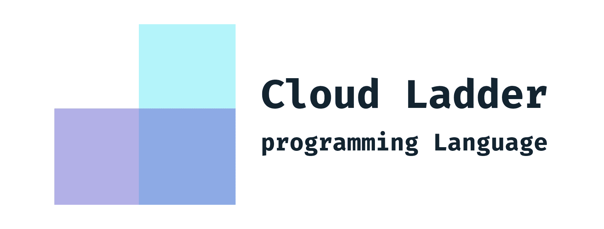

<div align="center">
  

## ☁ Cloud Ladder 程序设计语言

[]()
[]()
[]()
[]()

Cloud Ladder 是一门让人工智能、大数据更容易上手的编程语言。

</div>


## 内容
<details>
<summary>点击以展开</summary>

- [项目结构](#项目结构)
- [依赖](#依赖)
- [运行](#运行)
  * [IDEA](#idea)
- [编译与测试](#编译与测试)
  * [Windows](#windows)
  * [*nix & MAC OS](#*nix-%26-mac-os)
- [相关文档](#相关文档)
- [贡献者](#贡献者)
- [许可证](#许可证)

</details>


## 项目结构

```
.
├── readme.md               # 你所看到的文件
├── LICENSE                 # GPL3 许可证
├── .github/workflows/      # Github Action
├── scripts/                # 你所看到的文件
├── src/                    # 项目源代码
└── ...
```

## 依赖

- JDK 1.8

## 运行

### IDEA

```
# 直接执行这个类的 main 函数
src/test/java/ImageApiTester.java
```

## 编译与测试

### Windows

*如果你安装了最新版 gradle，也可以用 `gradle` 代替以下命令。*

构建项目:

```bash
./gradlew.bat build
```

测试项目:

```bash
./gradlew.bat test
./gradlew.bat testASTListener

```

### *nix & MAC OS

*如果你安装了最新版 gradle，也可以用 `gradle` 代替以下命令。*

构建项目:

```bash
./gradlew build
```

测试项目:

```bash
./gradlew test
./gradlew testASTListener

```

## 相关文档

- **[Current State of Cloud Ladder —— 2020年春 Cloud Ladder 初版实现心得分享](https://cloud-ladder.fkynjyq.com)**

## 贡献者

*本项目的存在离不开以下所有贡献者的辛勤贡献:*

[](https://sourcerer.io/fame/fky2015/BIT-SYS/cloud-ladder/links/0)[](https://sourcerer.io/fame/fky2015/BIT-SYS/cloud-ladder/links/1)[](https://sourcerer.io/fame/fky2015/BIT-SYS/cloud-ladder/links/2)[](https://sourcerer.io/fame/fky2015/BIT-SYS/cloud-ladder/links/3)[](https://sourcerer.io/fame/fky2015/BIT-SYS/cloud-ladder/links/4)[](https://sourcerer.io/fame/fky2015/BIT-SYS/cloud-ladder/links/5)[](https://sourcerer.io/fame/fky2015/BIT-SYS/cloud-ladder/links/6)[](https://sourcerer.io/fame/fky2015/BIT-SYS/cloud-ladder/links/7)


## 许可证

基于 [The GNU General Public License v3.0](LICENSE) 发布。

